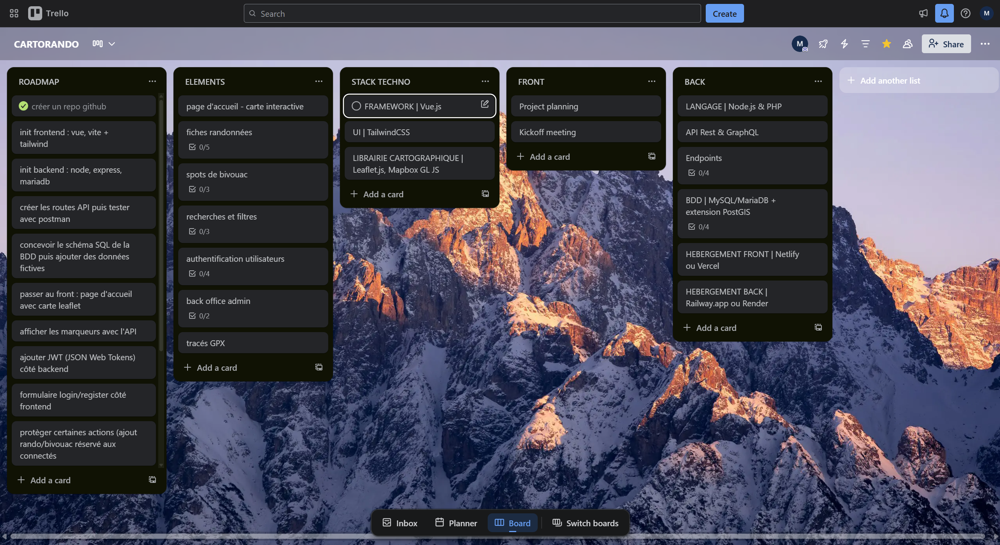

# 🗺️ Rando & Bivouac – Cartographie Outdoor

Projet full stack permettant de cartographier des **randonnées** et des **spots de bivouac**.  
Inspiré de sites comme *Altitude Rando*, ce projet est codé avec **Vue.js, Node.js et PostgreSQL/PostGIS**.

---

## 📖 Table des matières
- [📋 Suivi du projet (Trello)](#-suivi-du-projet-trello)

- [ Fonctionnalités](#-fonctionnalités)  
- [ Stack technique](#%EF%B8%8F-stack-technique)  
- [ Architecture du projet](#-architecture-du-projet)  
- [ Installation](#-installation)  
- [ Guide d'utilisation](#-utilisation)  
- [ Base de données](#%EF%B8%8F-base-de-données)  
- [ Authentification](#-authentification)  
- [ Déploiement](#-déploiement)  
- [ Améliorations futures](#-améliorations-futures)

---

## 📋 Suivi du projet

Le suivi des tâches et l’organisation du projet sont disponibles sur Trello :  
[Trello Board](https://trello.com/b/zuXba9GL/cartorando)



---

## Fonctionnalités
- Carte interactive (Leaflet/Mapbox)  
- Fiches randonnées : distance, dénivelé, difficulté, photos  
- Spots bivouacs 🏕️ (coordonnées GPS + infos)  
- Recherche & filtres (niveau, durée, localisation)  
- Authentification (création de compte, connexion)  
- Gestion des favoris ⭐  
- Ajout de randonnées/bivouacs par les utilisateurs connectés  
- Back-office admin (validation et modération)  
- (Bonus) Import de fichiers GPX  

---

## Stack technique
### Frontend
- [Vue.js 3](https://vuejs.org/) + [Vite](https://vitejs.dev/)  
- [TailwindCSS](https://tailwindcss.com/)  
- [Leaflet.js](https://leafletjs.com/)  

### Backend
- [Node.js](https://nodejs.org/) + [Express.js](https://expressjs.com/)  
- [Prisma](https://www.prisma.io/) (ORM)  

### Base de données
- [PostgreSQL](https://www.postgresql.org/)  
- [PostGIS](https://postgis.net/)  

### Hébergement
- Frontend : [Netlify](https://www.netlify.com/) ou [Vercel](https://vercel.com/)  
- Backend + DB : [Render](https://render.com/) ou [Railway](https://railway.app/)  

---

## Architecture du projet

```text
rando-bivouac/
├── backend/              # API (Express + Node.js)
│   ├── src/
│   │   ├── routes/       # Routes API (hikes, camps, users)
│   │   ├── controllers/  # Logique métier
│   │   ├── models/       # Prisma/ORM
│   │   ├── middleware/   # Auth, erreurs
│   │   └── index.js      # Entrée serveur
│   └── package.json
├── frontend/             # Vue.js (Vite + Tailwind)
│   ├── src/
│   │   ├── components/   # UI Components
│   │   ├── pages/        # Pages (Home, Randos, Profil…)
│   │   ├── store/        # Pinia/Vuex (état global)
│   │   └── main.js
│   └── package.json
├── database/             # Schéma SQL + migrations
│   └── schema.sql
└── README.md

```

---

## Guide d'utilisation
- Page d’accueil avec carte  
- Cliquez sur un marqueur → fiche détaillée  
- Connectez-vous pour ajouter une randonnée/bivouac  
- Admin : accès au dashboard modération  

---

## Base de données

### Table `users`
| id | name  | email          | password_hash | role  |
|----|-------|----------------|---------------|-------|
| 1  | Alice | alice@mail.com | ...           | user  |
| 2  | Admin | admin@mail.com | ...           | admin |

### Table `hikes`
| id | title       | distance_km | elevation_m | difficulty | geom (PostGIS) |
|----|------------|-------------|-------------|------------|----------------|
| 1  | Mont Blanc  | 15          | 1200        | Hard       | POINT(...)     |

### Table `camps`
| id | name     | description             | geom (PostGIS) |
|----|----------|------------------------|----------------|
| 1  | Lac Vert | Bivouac au bord du lac | POINT(...)     |

---

## Authentification
- **JWT** (JSON Web Tokens)  
- `POST /auth/register` → inscription  
- `POST /auth/login` → connexion  
- `GET /me` → profil utilisateur connecté  

---

## Déploiement
- Frontend : Netlify ou Vercel  
- Backend + DB : Render ou Railway  

---

## Améliorations futures
- Upload de fichiers GPX  
- Import/export CSV des randonnées  
- API météo intégrée sur chaque randonnée  
- Système de commentaires & avis  
- Application mobile (Vue Native / React Native)  

